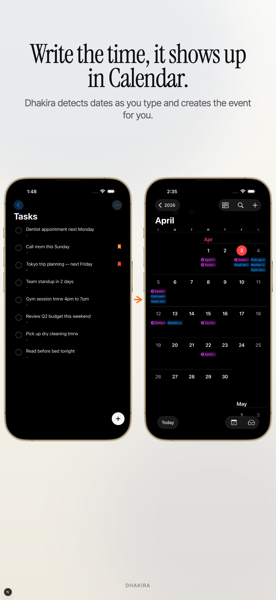
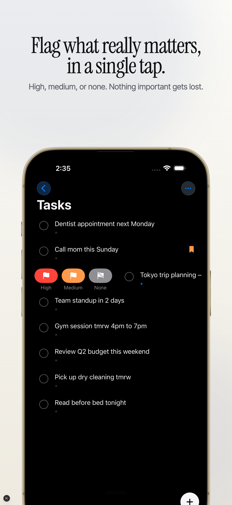
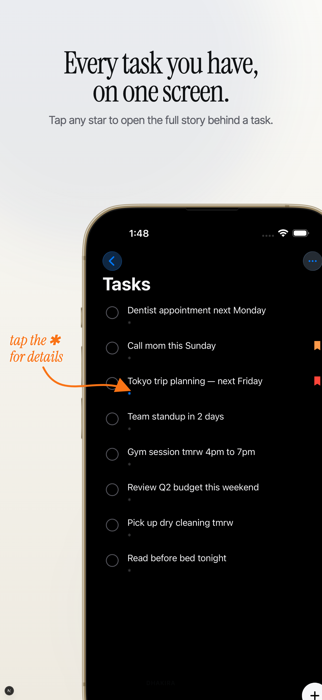
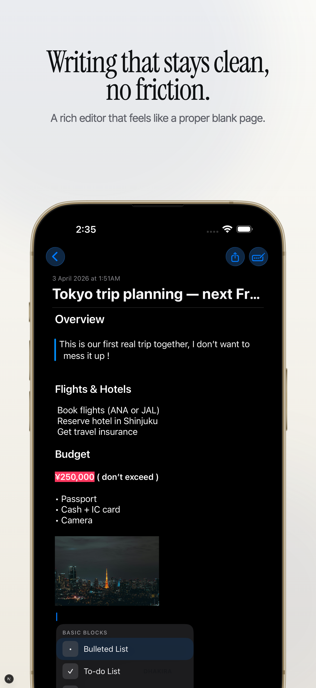
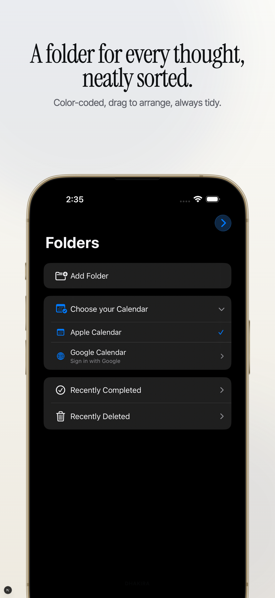

# Dhakira — Notes & Tasks for iPhone, iPad & Mac

> Write a task. Dhakira detects the date and puts it in your calendar — automatically.

**Free on the App Store · No paywall · No subscription**

[](https://apps.apple.com/app/dhakira/id6761504745)  
[dhakira.app](https://dhakira.app)

---

## Screenshots

<p align="center">
  
  
  
  
  
</p>

---

## What It Does

Dhakira is a task and note-taking app built for people who think in plain language. Write naturally — Dhakira parses dates like *"next Friday"*, *"in 3 days"*, or *"EOD"* and creates calendar events for you automatically, synced to both Apple Calendar and Google Calendar.

### Key Features

| Feature | Detail |
|---|---|
| **Auto Calendar Sync** | Write "dentist appointment next Monday" → event created in Apple/Google Calendar instantly |
| **Priority Flags** | High / Medium / None — one tap, never lose what matters |
| **Rich Editor** | Headings, bold/italic/color, bullet lists, to-do lists, image attachments, file attachments |
| **Folders** | Drag-to-reorder folders, nested lists, context-menu management |
| **10 Free Themes** | All themes free — no lock icons, no paywall |
| **iCloud Sync** | Notes, tasks, theme, sort order sync across iPhone + iPad + Mac in real time |
| **Widgets** | Home screen widgets, theme-synced |
| **PDF & Text Export** | Share any note as PDF or plain text |
| **Reminders Import** | Import from Apple Reminders |
| **Mac Catalyst** | Full native Mac app — not a scaled-up iPhone UI |

---

## Tech Stack

| Layer | Technology |
|---|---|
| Language | Swift |
| UI | SwiftUI |
| Persistence | SwiftData |
| Sync | CloudKit (iCloud) |
| Calendar | EventKit (Apple Calendar) + Google Calendar OAuth |
| Cross-platform | Mac Catalyst |
| Widgets | WidgetKit |

---

## Architecture

```
Dhakira/
├── Note-taking/              # Main app target (SwiftUI + SwiftData)
├── ProdNoteShared/           # Shared models and business logic
├── ProdNoteWidgetExtension/  # WidgetKit extension
├── Note-takingTests/         # Unit tests
└── Note-takingUITests/       # UI tests
```

- **SwiftData** for local persistence with automatic CloudKit sync
- **CloudKit Production Schema** deployed — syncs across all signed-in Apple ID devices
- **Google OAuth** verified and approved — no "unverified app" warning

---

## Platforms

| Platform | Supported |
|---|---|
| iPhone | iOS 17+ |
| iPad | iPadOS 17+ |
| Mac | macOS 14+ (Mac Catalyst) |

---

## Status

V1 approved by Apple and live on the App Store. V1.4 in development.

---

Built by [Yazeed Ghoban](https://github.com/pnsw123)
